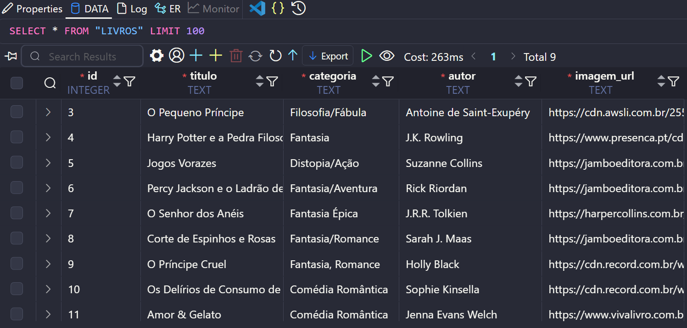

# 💌 API de Livros Doados 📚

Esta é a minha primeira API simples desenvolvida com **Flask** e **SQLite**.

A API permite o cadastro e a listagem de livros doados. Cada livro cadastrado contém as seguintes informações:

- 🎥 Título
- 🎭 Categoria
- 🎬 Autor
- 📘 Imagem da capa do livro (URL)

## Como rodar o projeto?

1. Faça o clone do repositório:
```bash
git clone <LINK_DO_REPOSITÓRIO>
cd nome_do_projeto
```

2. Criar um ambiente virtual (Obrigatório):

**Windows**
```bash
python -m venv venv
source venv/Scripts/activate
``` 
**Linux/Mac**
```bash
python3 -m venv venv
source venv/bin/activate
```

3. Instale as dependências:

```bash
pip install -r requirements.txt
```

4. Inicie o servidor:
```bash
python app.py
```

> A API estará disponível em http://127.0.0.1:5000/

---

## 🔗 Endpoints

### 📍 POST `/doar`

Endpoint para cadastro das informações do livro doado.

**Requisição (JSON)**
```json
{
    "titulo": "O Pequeno Príncipe",
    "categoria": "Filosofia/Fábula",
    "autor": "Antoine de Saint-Exupéry",
    "imagem_url": "https://exemplo.com"
  }
```

**Resposta (201):**
```json
{
  "mensagem": "Livro cadastrado com sucesso!"
}
```

---

### 📍 GET `/livros`

Retorna todos os livros cadastrados.

**Resposta (200):**
```json
[
  {
    "id": 1,
    "titulo": "O Pequeno Príncipe",
    "categoria": "Filosofia/Fábula",
    "autor": "Antoine de Saint-Exupéry",
    "imagem_url": "https://exemplo.com"
  }
]
```

---

## 🛠️ Tecnologias Utilizadas

- Python 3
- Flask
- SQLite
- Flask-CORS

## 📸 Captura de Tela do Database Client com os Livros Cadastrados


---

👩‍💻 Desenvolvido por Fernanda Corrêa 🚀
Se gostou do projeto, não esqueça de dar uma ⭐ no repositório! 😊